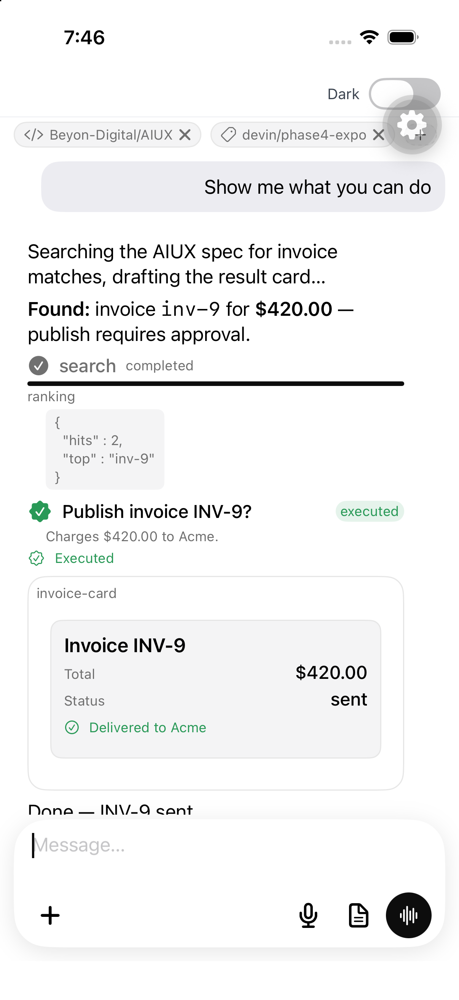
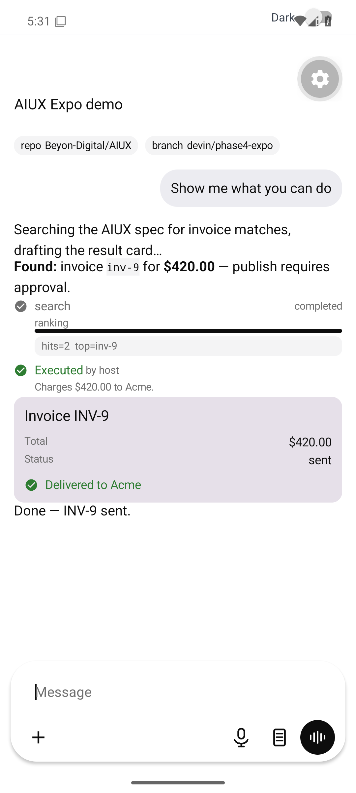
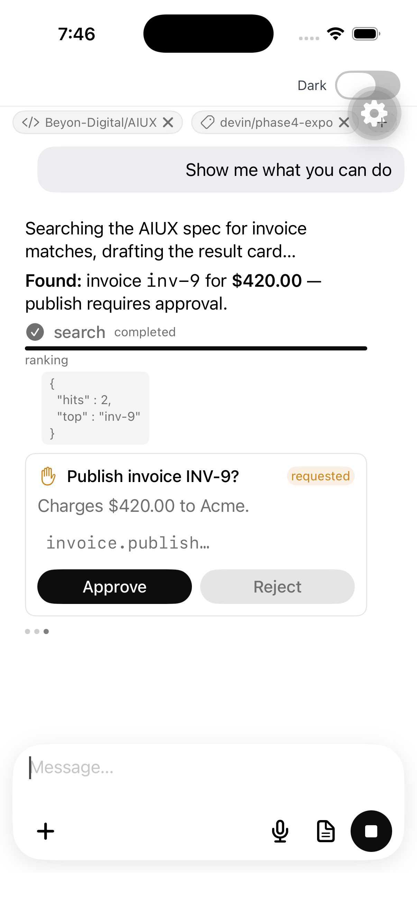
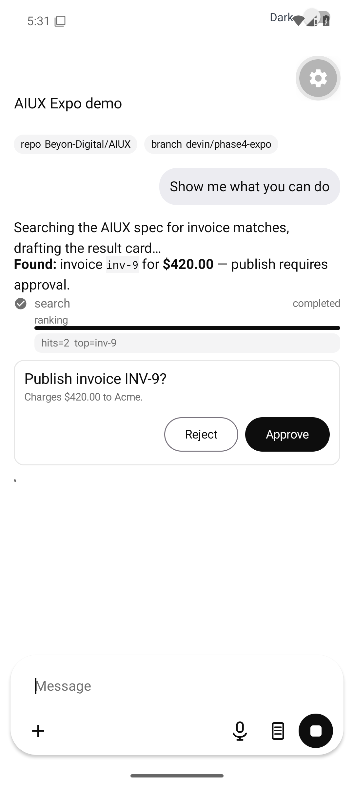
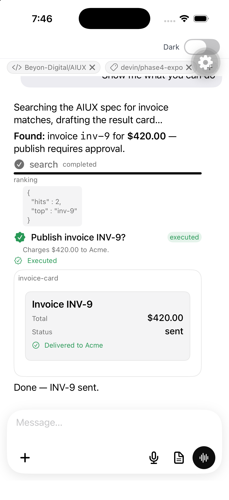
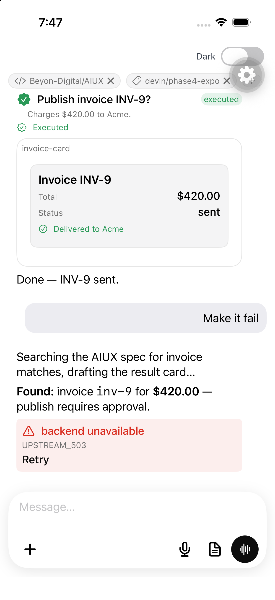
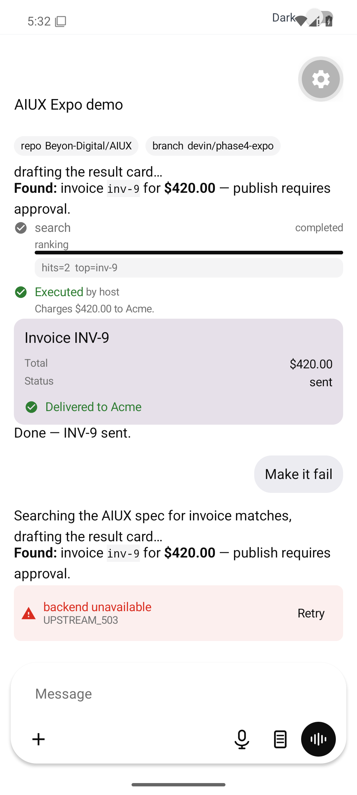
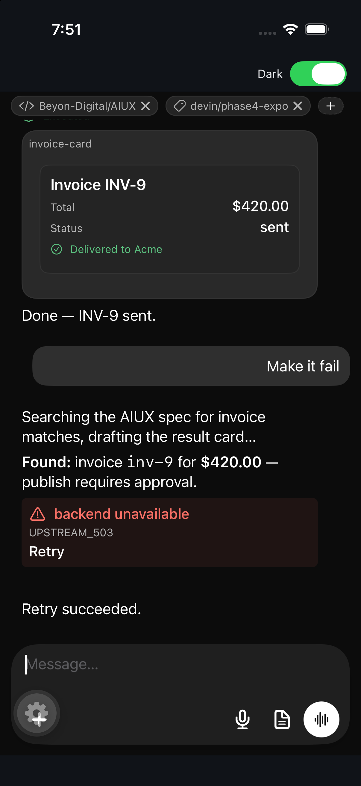
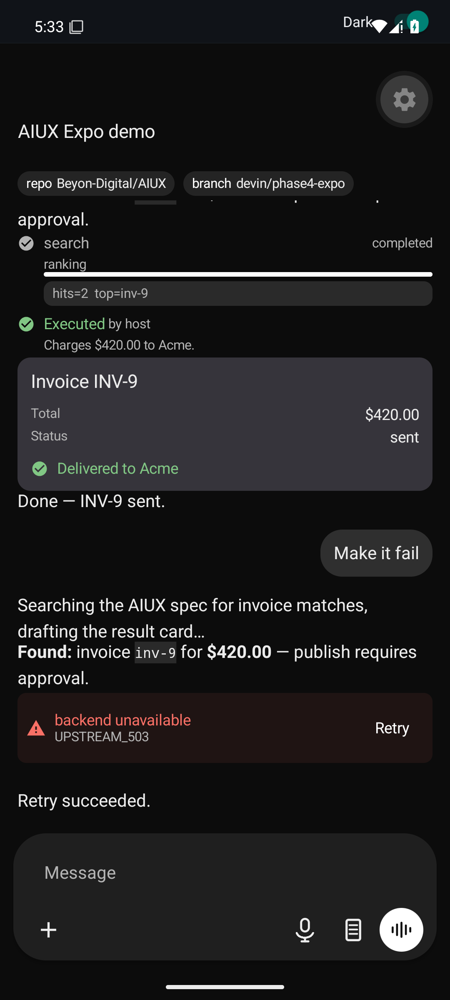

# AIUX documentation

AIUX is a reusable, framework-independent AI interaction platform: one protocol,
one Rust state engine, one semantic surface schema — rendered natively by
SwiftUI, Jetpack Compose, React DOM, and Flutter, and bridged into Expo/React
Native behind a single native boundary.

```
Host transport → AIUXEvent[] → Rust Core → AIUXSnapshot → Renderer
```

## Getting started

- [Consumer installation](integration/install.md) — versioned install commands,
  native prerequisites, per-client availability.
- [Quickstart](getting-started/quickstart.md) — a working session in a few
  minutes on each platform (Web, Expo, SwiftUI, Compose, Flutter, Rust).
- [Usage guide](integration/usage.md) — the standard host integration flow.
- [Live demo captures](#live-demo) — screenshots and videos from the example
  app running on the iOS simulator and Android emulator.

## Core concepts

- [Architecture overview](architecture/overview.md) — crates, renderers,
  bridges, and where responsibility lives.
- [Protocol specification](protocol/specification.md) — event envelopes,
  entities, ordering, idempotency.
- [Event lifecycle](protocol/event-lifecycle.md) — the lifecycle of a run:
  prompt → stream → tool → approval → surface → done.
- [Surface schema](protocol/surface-schema.md) — the cross-platform
  agent-authored UI tree.
- [Session contract](api/session-contract.md) — the frozen `AiuxSession`
  JSON facade every binding implements.
- [Dispatch semantics](guides/dispatch-semantics.md) — sequences, duplicate
  ids, the reorder buffer, `DispatchReport`, and `ProtocolError`s.

## API reference

Per-package public API, verified against the source:

- [Session contract (all platforms)](api/session-contract.md)
- [JavaScript core — `@beyond-digital/aiux-core`](api/js-core.md)
- [Web renderer — `@beyond-digital/aiux-web`](api/web.md)
- [Expo bridge — `@beyond-digital/aiux-expo`](api/expo.md)
- [SwiftUI renderer](api/swiftui.md)
- [Compose renderer](api/compose.md)
- [Flutter renderer](api/flutter.md)
- [Transports & adapters](api/transports-adapters.md) —
  `aiux-transport-js`, `adapter-sse`, `adapter-websocket`, `adapter-ai-sdk`
- [Semantic actions](guides/actions.md) — every `aiux.*` action id a renderer
  can emit, and what your host must implement.
- [Protocol API reference](protocol/api-reference.md) — schemas, types and
  event payloads.

## Customisation

- [Theming](guides/theming.md) — color roles, typography, spacing, radius,
  motion, density and per-platform theme APIs.
- [Composer toolbar](guides/composer-toolbar.md) — hide built-ins, append
  custom tools, shared glyph vocabulary.
- [Surfaces & custom nodes](guides/surfaces.md) — the 31-node surface schema,
  forms/fields, and host-registered `custom` renderers per platform.
- [Custom tool UI](integration/custom-tool-ui.md) — render a tool call with
  your own widget while the core tracks its lifecycle.
- [Actions & host policy](guides/actions.md) — the action contract between
  renderers and your app.

## Integrating a model

- [Connecting a model](guides/connecting-a-model.md) — transports, wire
  adapters, normalization, and a worked OpenRouter example.
- [Transport adapters](integration/transport-adapters.md) — adapter selection
  guide (SSE vs WebSocket vs AI SDK).
- [Persistence & resume](guides/persistence.md) — `serialize()`/`restore()`,
  what to persist, sequence resumption.
- [Testing & fixtures](guides/testing.md) — conformance fixtures, `MockCore`,
  fixture players, replaying scenarios.

## Platform integration guides

- [Expo / React Native](integration/expo.md)
- [SwiftUI](integration/swiftui.md)
- [Jetpack Compose](integration/compose.md)
- [Flutter](../examples/flutter/README.md)

## Operations

- [Compatibility matrix](integration/compatibility-matrix.md) &
  [policy](integration/compatibility-policy.md)
- [Migration notes](integration/migration.md)
- [CI & release pipeline](integration/ci-release.md) ·
  [publishing setup](integration/publishing-setup.md)
- [Dependency audit](integration/dependency-audit.md)
- [Troubleshooting](troubleshooting.md)
- [Accessibility](renderers/accessibility.md) ·
  [Large conversations](renderers/large-conversations.md) ·
  [Theme contract](renderers/theme-contract.md)

## Design records

- [Plan of record](PLAN.md) · [Execution tracker](../TASKS.md)
- ADRs: [0001](adr/0001-rust-as-canonical-state-engine.md) Rust state engine ·
  [0002](adr/0002-renderer-architecture.md) renderer architecture ·
  [0003](adr/0003-protocol-versioning.md) versioning ·
  [0004](adr/0004-transport-ownership.md) transport ownership ·
  [0005](adr/0005-ffi-strategy.md) FFI strategy ·
  [0006](adr/0006-surface-schema-philosophy.md) surface philosophy ·
  [0007](adr/0007-surface-dsl-expansion.md) surface DSL expansion

## Live demo

The [Expo example](../examples/expo) drives a scripted protocol scenario —
streaming answer, tool call, approval gate, generated form surface, error +
retry, cancellation — against the real Rust core on-device. Captured live on
the iOS simulator and Android emulator:

| | iOS simulator | Android emulator |
| --- | --- | --- |
| Conversation (light) |  |  |
| Tool + approval |  |  |
| Generated surface |  |  |
| Error + retry |  |  |
| Dark mode |  |  |

Videos: [iOS simulator](assets/videos/ios-demo.mp4) ·
[Android emulator](assets/videos/android-demo.mp4)
